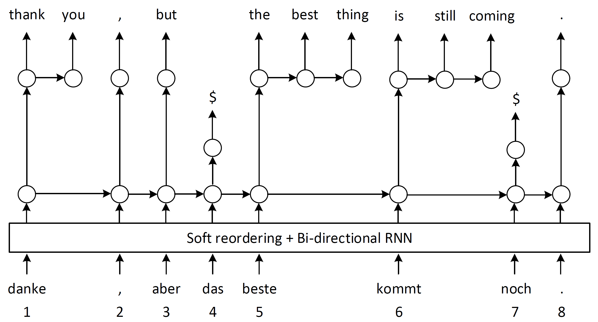

# Introduction
This is NPMT, the source codes of [Towards Nerual Phrase-based Machine Translation](https://arxiv.org/abs/1706.05565) and [Sequence Modeling via Segmentations](https://arxiv.org/abs/1702.07463) from Microsoft Research.
It is built on top of the [fairseq toolkit](https://github.com/facebookresearch/fairseq) in [Torch](http://torch.ch/).
We present the setup and Neural Machine Translation (NMT) experiments in [Towards Nerual Phrase-based Machine Translation](https://arxiv.org/abs/1706.05565).

## NPMT 
Neural Phrase-based Machine Translation (NPMT) explicitly models the phrase structures in output sequences using Sleep-WAke Networks (SWAN), a recently proposed segmentation-based sequence modeling method. 
To mitigate the monotonic alignment requirement of SWAN, we introduce a new layer to perform (soft) local reordering of input sequences. 
Different from existing neural machine translation (NMT) approaches, NPMT does not use attention-based decoding mechanisms. 
Instead, it directly outputs phrases in a sequential order and can decode in linear time. 

Model architecture


An illustration of using NPMT in German-English translation



Please refer to the [PR](https://github.com/posenhuang/NPMT/pull/1) for our implementations. Our implementation is based on the [lastest version](https://github.com/posenhuang/NPMT/commit/7d017f0a46a3cddfc420a4778d9541ba38b6a43d) of fairseq.  


# Citation

If you use the code in your paper, then please cite it as:

```
@article{pshuang2018NPMT,
  author    = {Po{-}Sen Huang and
               Chong Wang and
               Sitao Huang and
               Dengyong Zhou and
               Li Deng},
  title     = {Towards Neural Phrase-based Machine Translation},
  journal   = {CoRR},
  volume    = {abs/1706.05565},
  year      = {2017},
  url       = {http://arxiv.org/abs/1706.05565},
  archivePrefix = {arXiv},
  eprint    = {1706.05565},
}
```

and

```
@inproceedings{wang2017SWAN,
  author    = {Chong Wang and
               Yining Wang and
               Po{-}Sen Huang and
               Abdelrahman Mohamed and
               Dengyong Zhou and
               Li Deng},
  title     = {Sequence Modeling via Segmentations},
  booktitle = {Proceedings of the 34th International Conference on Machine Learning,
               {ICML} 2017, Sydney, NSW, Australia, 6-11 August 2017},
  pages     = {3674--3683},
  year      = {2017},
}
```

# Requirements and Installation
* A computer running macOS or Linux
* For training new models, you'll also need a NVIDIA GPU and [NCCL](https://github.com/NVIDIA/nccl)
* A [Torch installation](http://torch.ch/docs/getting-started.html). For maximum speed, we recommend using LuaJIT and [Intel MKL](https://software.intel.com/en-us/intel-mkl).
* A recent version [nn](https://github.com/torch/nn). The minimum required version is from May 5th, 2017. A simple `luarocks install nn` is sufficient to update your locally installed version.

Install fairseq by cloning the GitHub repository and running
```
luarocks make rocks/fairseq-scm-1.rockspec
```
LuaRocks will fetch and build any additional dependencies that may be missing.
In order to install the CPU-only version (which is only useful for translating new data with an existing model), do
```
luarocks make rocks/fairseq-cpu-scm-1.rockspec
```

The LuaRocks installation provides a command-line tool that includes the following functionality:
* `fairseq preprocess`: Data pre-processing: build vocabularies and binarize training data
* `fairseq train`: Train a new model on one or multiple GPUs
* `fairseq generate`: Translate pre-processed data with a trained model
* `fairseq generate-lines`: Translate raw text with a trained model
* `fairseq score`: BLEU scoring of generated translations against reference translations
* `fairseq tofloat`: Convert a trained model to a CPU model
* `fairseq optimize-fconv`: Optimize a fully convolutional model for generation. This can also be achieved by passing the `-fconvfast` flag to the generation scripts.

# Quick Start

## Training a New Model

### Data Pre-processing
The fairseq source distribution contains an example pre-processing script for
the IWSLT14 German-English corpus.
Pre-process and binarize the data as follows:
```
$ cd data/
$ bash prepare-iwslt14.sh
$ cd ..
$ TEXT=data/iwslt14.tokenized.de-en
$ fairseq preprocess -sourcelang de -targetlang en \
  -trainpref $TEXT/train -validpref $TEXT/valid -testpref $TEXT/test \
  -thresholdsrc 3 -thresholdtgt 3 -destdir data-bin/iwslt14.tokenized.de-en
```
This will write binarized data that can be used for model training to data-bin/iwslt14.tokenized.de-en.

We also provide an example of pre-processing script for the IWSLT15 English-Vietnamese corpus.
Pre-process and binarize the data as follows:
```
$ cd data/
$ bash prepare-iwslt15.sh
$ cd ..
$ TEXT=data/iwslt15
$ fairseq preprocess -sourcelang en -targetlang vi \
 -trainpref $TEXT/train -validpref $TEXT/tst2012 -testpref $TEXT/tst2013 \
 -thresholdsrc 5 -thresholdtgt 5 -destdir data-bin/iwslt15.tokenized.en-vi
```

### Training
Use `fairseq train` to train a new model.
Here a few example settings that work well for the IWSLT14, IWSLT15 datasets:
```
# NPMT model (IWSLT DE-EN)
$ mkdir -p trainings/iwslt_de_en
$ fairseq train -sourcelang de -targetlang en -datadir data-bin/iwslt14.tokenized.de-en \
  -model npmt -nhid 256 -dec_unit_size 512 -dropout .5 dropout_hid 0 -npmt_dropout .5 \
  -optim adam -lr 0.001 -batchsize 32 -log_interval 100 nlayer 2 -nenclayer 2 -kwidth 7 \
  -max_segment_len 6 -rnn_mode GRU -group_size 500 -use_resnet_enc -use_resnet_dec -log
  -momentum 0.99 -clip 10 -maxbatch 600 -bptt 0 -maxepoch 100 -ndatathreads 4 -seed 1002 
  -maxsourcelen 75 -num_lower_win_layers 1 -save_interval 250 -use_accel -noearlystop \
  -validbleu -lrshrink 1.25 -minepochtoanneal 18 -annealing_type slow \
  -savedir trainings/iwslt_de_en

# NPMT model (IWSLT EN-DE)
$ mkdir -p trainings/iwslt_en_de
$ fairseq train -sourcelang en -targetlang de -datadir data-bin/iwslt14.tokenized.en-de \
  -model npmt -nhid 256 -dec_unit_size 512 -dropout .5 -dropout_hid 0 -npmt_dropout .5 \
  -optim adam -lr 0.001 -batchsize 32 -log_interval 100 -nlayer 2 -nenclayer 2 -kwidth 7 \
  -max_segment_len 6 -rnn_mode GRU -group_size 500 -use_resnet_enc -use_resnet_dec \
  -log -momentum 0.99 -clip 10 -maxbatch 800 -bptt 0 -maxepoch 100 -ndatathreads 4 \
  -seed 1002 -maxsourcelen 75 -num_lower_win_layers 1 -save_interval 250 -use_accel \
  -noearlystop -validbleu -lrshrink 1.25 -minepochtoaneal 15 \
  -annealing_type slow -savedir trainings/iwslt_en_de
  
# NPMT model (IWSLT EN-VI)
$ mkdir -p trainings/iwslt_en_vi
$ fairseq train -sourcelang en -targetlang vi -datadir data-bin/iwslt15.tokenized.en-vi \
  -model npmt -nhid 512 -dec_unit_size 512 -dropout .4 -dropout_hid 0 -npmt_dropout .4 \
  -optim adam -lr 0.001 -batchsize 48 -log_interval 100 -nlayer 3 -nenclayer 2 -kwidth 7 \
  -max_segment_len 7 -rnn_mode LSTM   -group_size 800 -use_resnet_enc -use_resnet_dec -log \
  -momentum 0.99 -clip 500 -maxbatch 800 -bptt 0 -maxepoch 50 -ndatathreads 4 -seed 1002 \
  -maxsourcelen 75 -num_lower_win_layers 1 -save_interval 250 -use_accel -noearlystop \
  -validbleu -nembed 512 -lrshrink 1.25 -minepochtoanneal 8 -annealing_type slow \
  -savedir trainings/iwslt_en_vi
```


By default, `fairseq train` will use all available GPUs on your machine.
Use the [CUDA_VISIBLE_DEVICES](http://acceleware.com/blog/cudavisibledevices-masking-gpus) environment variable to select specific GPUs or `-ngpus` to change the number of GPU devices that will be used.

### Generation
Once your model is trained, you can translate with it using `fairseq generate` (for binarized data) or `fairseq generate-lines` (for text).
Here, we'll do it for a NPMT model:
```

# Translate some text
$ DATA=data-bin/iwslt14.tokenized.de-en
$ fairseq generate-lines -sourcedict $DATA/dict.de.th7 -targetdict $DATA/dict.en.th7 \
  -path trainings/iwslt_de_en/model_bestbleu.th7 -beam 1 -model npmt
| [target] Dictionary: 22823 types
| [source] Dictionary: 32010 types
> danke , aber das beste kommt noch .
max decoding:   | 1:184 1:15| 2:4| 3:28| 4:6 4:282| 6:16 6:201 6:311| 8:5|
avg. phrase size 1.666667
S       danke , aber das beste kommt noch . <pad>
O       danke , aber das beste kommt noch .
H       -0.10934638977051       thank you , but the best is still coming .
A       1

```
where the ``max decoding`` suggests the output segments are ``| thank you | , | but | the best | is still coming | . |``, and ``avg. phrase size`` represents the average phrase length ``10/6 = 1.666667``.


Generation with the binarized test sets can be run as follows (not in batched mode), e.g. for German-English:
```

$ fairseq generate -sourcelang de -targetlang en -datadir data-bin/iwslt14.tokenized.de-en \
  -path trainings/iwslt_de_en/model_bestbleu.th7 -beam 10 -lenpen 1 -dataset test -model npmt | tee /tmp/gen.out
...
| Translated 6750 sentences (137891 tokens) in 3013.7s (45.75 tokens/s)
| Timings: setup 10.7s (0.4%), encoder 28.2s (0.9%), decoder 2747.9s (91.2%), search_results 0.0s (0.0%), search_prune 0.0s (0.0%)
| BLEU4 = 29.92, 64.7/37.9/23.8/15.3 (BP=0.973, ratio=1.027, sys_len=127660, ref_len=131141)

# Word-level BLEU scoring:
$ grep ^H /tmp/gen.out | cut -f3- | sed 's/@@ //g' > /tmp/gen.out.sys
$ grep ^T /tmp/gen.out | cut -f2- | sed 's/@@ //g' > /tmp/gen.out.ref
$ fairseq score -sys /tmp/gen.out.sys -ref /tmp/gen.out.ref
BLEU4 = 29.92, 64.7/37.9/23.8/15.3 (BP=0.973, ratio=1.027, sys_len=127660, ref_len=131141)

```


# License
fairseq is BSD-licensed. The released codes modified the original fairseq are BSD-licensed.
The rest of the codes are MIT-licensed.
